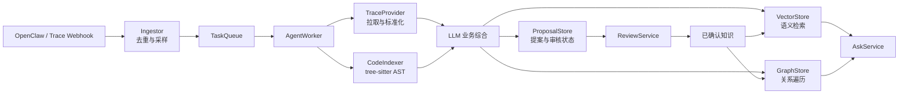
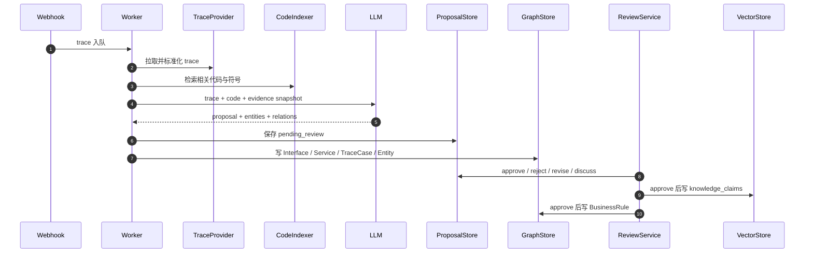
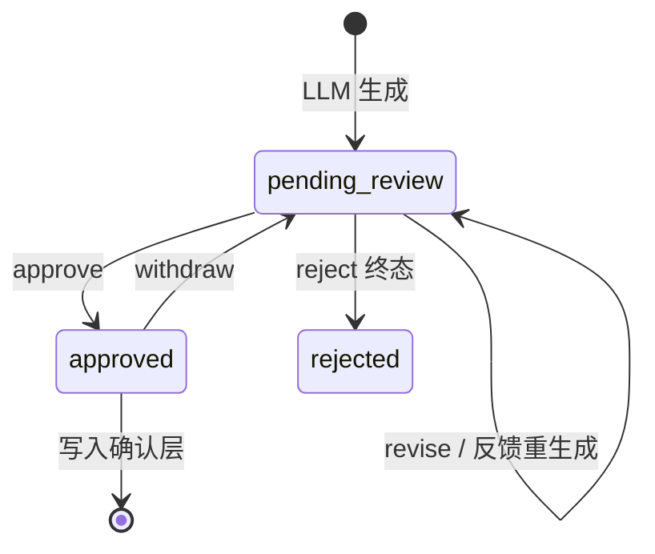

# Trace-Driven Knowledge Agent

一个由线上 trace 驱动、结合仓库代码持续提炼业务语义的知识智能体平台。

系统把“线上真实调用 + 静态代码”转换成可审核、可追溯、可检索的业务知识，建立业务概念与接口、服务、代码实现之间的映射。

> 当前版本定位是**业务语义底座**，不是 BI、通用代码问答或“业务问题答案机”。它能回答“某接口做什么、调用了谁、涉及哪些业务概念”，但不能仅凭 trace 直接解释“为什么退款率上涨”这类需要业务指标、时序对比和因果分析的问题。

## 核心能力

- 接收 OpenClaw webhook 或手动提交的 trace 事件
- 对 trace 去重、采样、标准化并提取服务调用链
- 使用 tree-sitter 索引 Go / Java 代码，按 Git commit 增量刷新
- 将 trace、日志锚点和代码符号交叉送入 LLM，生成结构化知识提案
- 抽取业务实体、关系和领域社区，写入向量库与知识图谱
- 支持确认、驳回、修订、对话式审核和置信度传播
- 使用 ReAct 检索智能体完成知识问答，无 LLM 时自动降级
- 所有已确认知识保留 trace、代码符号和 commit 证据

## 系统边界

| 问题类型 | 示例 | 当前是否支持 |
| --- | --- | --- |
| 接口语义 | `POST /order/create` 是做什么的？ | ✅ |
| 技术链路 | 下单接口调用了哪些服务？ | ✅ |
| 业务概念定位 | “退款”对应哪些接口和服务？ | ✅ |
| 领域概览 | 支付域包含哪些实体和接口？ | ✅ |
| 指标归因 | 为什么本月退款率上涨？ | ❌ |
| 因果判断 | 哪次配置变更导致转化下降？ | ❌ |

要进一步回答指标归因问题，还需要接入业务指标、时间趋势和变更事件，并在语义层之上增加因果验证能力。

## 整体架构



生产环境可以按接口替换基础设施：

| 当前实现 | 可替换为 |
| --- | --- |
| 内存 `TaskQueue` | Redis Streams |
| Chroma `VectorStore` | Qdrant / Milvus |
| SQLite `GraphStore` | Neo4j |
| SQLite `ProposalStore` | PostgreSQL |
| 本地 `RawArtifactStore` | 对象存储 |
| TraceProvider 适配层 | 内部 Trace MCP / API |
| LLMClient 抽象 | 实际模型服务 |

## 一条 trace 如何变成知识



### Trace 日志解析

日志解析采用配置优先、逐级降级的策略：

1. `parsers.yaml` 精确匹配服务或语言，提取文件、行号、函数等锚点。
2. 未配置服务使用通用正则提取粗粒度 `file:line` 锚点。
3. 完全无法解析时，仍保留 span 骨架和结构化下游调用链，不阻塞知识生产。

日志锚点与代码符号通过 `file + line range` 关联，即 `start_line <= log_line <= end_line`；函数名仅用于命中后的校验和加权。关联失败时保留原始锚点作为 LLM 线索。

## 数据模型

系统使用三种存储，各自负责一种查询模式：

| 存储 | 当前实现 | 保存内容 | 主要用途 |
| --- | --- | --- | --- |
| 向量存储 | Chroma | 文本、embedding、检索元数据 | 找语义入口 |
| 图存储 | SQLite | 节点、关系、权重 | 展开关联 |
| 提案存储 | SQLite | 提案、状态、审核对话 | 管理知识生命周期 |

默认数据目录：

```text
data/
├── chroma/                 # Chroma 向量库
└── agent_platform.db       # 图、提案和审核数据
```

### 五层知识结构

| 层级 | 节点 | 含义 |
| --- | --- | --- |
| L1 代码索引 | `CodeSymbol` | 函数、方法、调用关系；repo 和 commit 为属性 |
| L2 流量 | `Interface`、`Service`、`TraceCase` | 真实接口与服务调用事实 |
| L3 业务实体 | `Entity` | 订单、支付、司机、风控能力等业务语义 |
| L4 领域社区 | `Community` | 由实体关系聚类出的业务领域 |
| L5 确认知识 | `BusinessRule` | 经审核或传播确认、带证据的知识 |

模型刻意保持精简：Repo、Commit、Span、Evidence 不建独立节点，而作为现有节点属性保存。新增节点或关系前必须先证明存在真实查询场景，避免 ontology 膨胀。

### 图关系

| 关系 | 方向 | 默认权重 | 含义 |
| --- | --- | ---: | --- |
| `HAS_TRACE` | Interface → TraceCase | 0.9 | 接口包含真实 trace 样本 |
| `CALLS_SERVICE` | Interface → Service | 0.7 | 接口调用下游服务 |
| `MENTIONS` | Interface → Entity | 0.6 | 接口涉及业务实体 |
| `CALLS` | CodeSymbol → CodeSymbol | 0.5 | 代码符号调用 |
| `RELATED_TO` | Entity → Entity | 0.1–1.0 | 显式业务关系或低权重共现 |
| `BELONGS_TO` | Entity → Community | 1.0 | 实体归属领域社区 |

图遍历必须限制跳数和返回数量，单次问答不能执行无界 BFS。

### 向量集合

| Collection | 内容 | 写入时机 |
| --- | --- | --- |
| `code_chunks` | 代码片段与符号元数据 | 代码索引时 |
| `knowledge_claims` | 已确认的业务知识 | proposal approve 后 |
| `entities` | 归一化业务实体 | 实体合并时 |
| `community_summaries` | 领域摘要 | 社区检测后 |

Trace 本身是结构化事实，不做向量检索：完整内容进入 raw artifacts，关联关系通过 `TraceCase` 图节点展开。

### 业务实体类型

实体类型只能使用以下枚举：

- `business_concept`
- `data_entity`
- `actor`
- `external_service`
- `event`
- `capability`
- `other`

无法识别的类型降级为 `other`。技术类名称如 `OrderController` 不应被抽成业务实体；同义概念应合并为一个实体，并记录 aliases。

## 提案与审核

LLM 产出先进入草稿层，确认后才进入对外检索的知识层。



### 三级交互策略

目标交互按置信度降低人工成本：

| 等级 | 场景 | 交互方式 |
| --- | --- | --- |
| 高置信度 | 多重证据充分，传播后分数达到阈值 | 自动确认并静默通知 |
| 中置信度 | 结论明确但仍有不确定点 | 卡片一键确认、驳回或讨论 |
| 低置信度 | 证据不足或存在关键疑问 | 多轮对话式审核 |

当前硬约束是 `confidence_score >= 0.8` 才能自动进入 `approved`；单条 trace 不能直接给出 0.9 以上分数。置信度更新必须同时维护数值分数与离散等级。

已实现的审核闭环：

- `approve`：若存在审核对话，先由 LLM 把讨论结晶到提案，再入库；结晶失败则安全使用原提案。
- `reject`：有理由且配置 LLM 时，基于原提案和历次反馈反思重生成，最多 3 次；失败或耗尽后进入终态 rejected。
- `revise`：修改提案并递增 version。
- `withdraw`：将已确认知识退回待审状态。

OpenClaw 的卡片推送、静默通知、限流与静默时段仍属于待接入能力；当前服务已提供审核回调 API。

## 置信度与知识生命周期

- 默认分数：low = 0.3、medium = 0.6、high = 0.85。
- 自动确认阈值：`confidence_score >= 0.8`。
- 传播公式：`new = old + source × edge_weight × decay_factor`，最多 3 跳，变化小于 0.01 时停止。
- 高频强化：`base × (1 + 0.3 × ln(1 + mentions))`。
- 时间加权：`1 / (1 + days_since / 90)`，只在检索时计算，不回写存储分数。
- 同一接口存在矛盾知识时，检索上下文携带创建时间，由 LLM 优先采用较新的矛盾结论；互补信息可以共存。

实体的 `last_seen_at` 会在新 trace 再次提及时刷新，因此重新观测会自然恢复 recency 权重。

## 知识问答

配置 LLM 时，`AskService` 使用 ReAct agent，根据问题自主选择检索工具并最多迭代 3 轮：

- `search_knowledge`：已确认知识
- `search_entities`：业务实体
- `search_community`：领域社区
- `expand_graph`：接口、服务、trace 和实体关系

召回全空时返回“暂无足够证据”，不允许模型自由编造；agent 异常或没有配置 LLM 时，自动降级到固定四路召回和模板答案。

当前融合仍是简单 union，BM25 + RRF 是后续优化项。

## 快速开始

### 环境要求

- Python 3.11+
- 可选：支持 OpenAI-compatible 或项目适配的实际 LLM 服务

### 安装

```bash
python3 -m venv .venv
source .venv/bin/activate
pip install -e '.[tree-sitter,llm,dev]'
```

如果只运行 HTTP 服务，可使用：

```bash
pip install -e .
```

### 配置模型

模型配置示例见 [`llm_config.yaml`](llm_config.yaml)。未配置模型时，服务仍可启动，问答会使用降级路径。

### 启动服务

```bash
python main.py
```

指定监听地址、数据目录和待索引仓库：

```bash
python main.py \
  --host 0.0.0.0 \
  --port 8000 \
  --data-dir ./data \
  --repo order-svc=/path/to/order-svc
```

也可以使用安装后的命令：

```bash
agent-platform --repo order-svc=/path/to/order-svc
```

### 运行测试

```bash
pytest
```

或使用标准库 unittest：

```bash
python -m unittest discover tests
```

## HTTP API

| 方法 | 路径 | 用途 |
| --- | --- | --- |
| POST | `/webhooks/openclaw/trace` | 接收 trace 事件 |
| GET | `/reviews/{proposal_id}` | 获取待审提案 |
| POST | `/reviews/{proposal_id}/messages` | 追加审核对话 |
| POST | `/reviews/{proposal_id}/approve` | 确认提案 |
| POST | `/reviews/{proposal_id}/reject` | 驳回提案 |
| POST | `/reviews/{proposal_id}/revise` | 修订提案 |
| POST | `/proposals/{proposal_id}/withdraw` | 撤回已确认提案 |
| GET | `/proposals/pending` | 查询待审提案 |
| POST | `/ask` | 知识问答 |
| GET | `/entities/search` | 搜索业务实体 |
| GET | `/communities` | 查询领域社区 |
| POST | `/communities/refresh` | 刷新社区检测 |
| GET | `/stats/coverage` | 查询知识覆盖情况 |
| POST | `/collector/run` | 手动触发采集 |

## 关键不变量

开发和扩展时必须遵守：

1. 所有普通知识提案必须至少关联一个 `trace_id`；未来由用户反馈结晶的知识除外。
2. 单条 trace 的置信度上限是 medium，不能直接产出 high。
3. `confidence_score < 0.8` 的提案不能自动确认。
4. 实体名必须经过 `entities.normalize_name`，合并必须走 `merge_into_graph()`。
5. LLM 输出必须使用结构化 tool call，并经过 validator。
6. 实体类型和关系类型必须使用本文列出的枚举。
7. `RELATED_TO` 两端必须出现在同一次 LLM 输出的 entities 数组中。
8. 写图必须通过 worker 或 `RAGLoader`，不能绕过领域逻辑直接写边。
9. 同一 trace 内重复出现的实体只增加一次 mentions。
10. 社区检测使用固定 seed，社区 ID 从成员集合 hash 派生，以保证幂等。
11. 图遍历必须设置跳数与结果数量上限。
12. Trace 与代码不一致时不能标为高置信知识。

完整规约和扩展流程见 [`AGENTS.md`](AGENTS.md)，详细字段说明见 [`docs/data-model.md`](docs/data-model.md)，交互设计稿见 [`docs/interaction-design.md`](docs/interaction-design.md)。

## 当前完成度与路线图

已完成：

- Worker 主链路、实体抽取、知识图谱和社区检测
- ReAct 问答与无模型降级
- mentions 强化与 recency 检索加权
- 检索时矛盾消解
- Reject 反馈重生成与 Approve 对话结晶
- Git commit 驱动的代码索引刷新
- 配置化 trace 日志 parser 与锚点到 CodeSymbol 的区间关联

优先缺口：

1. **P0：隐私** — trace 入库前的 PII / secret 清洗和统一审计日志。
2. **P1：Trace 详情与闭环** — 逐 span 拉取 detail、evidence snapshot 采样去重、问答反馈结晶。
3. **P2：检索质量** — BM25 + RRF、质量评分、自愈 lint 和矛盾检查。
4. **P3：按真实需求观察** — 显式 supersession、分类半衰期、更多 code-to-business 图边。

多 agent 协同不在当前实现范围内；当前采用单 worker 串行写图，优先保持一致性和实现简单。

## 设计原则

- **真实流量优先**：trace 证明“真实发生过”，代码帮助解释“如何发生”。
- **证据可追溯**：知识必须能回到 trace、代码符号和 commit。
- **草稿与确认隔离**：未经确认的提案不能污染对外知识库。
- **检索时处理变化**：保留历史知识，在完整上下文中消解矛盾和时间差异。
- **渐进精度**：解析与关联失败时降级，而不是阻断整条链路。
- **按需求演进模型**：优先复用和精简现有节点与关系，不预先穷举 ontology。
